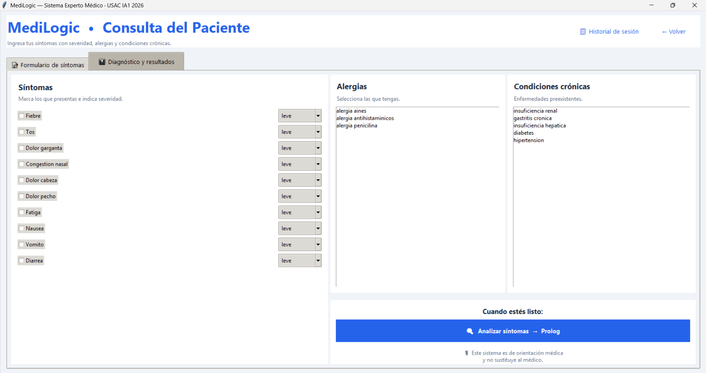
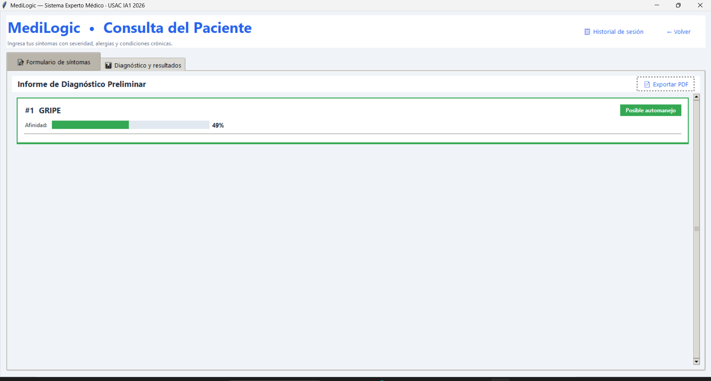
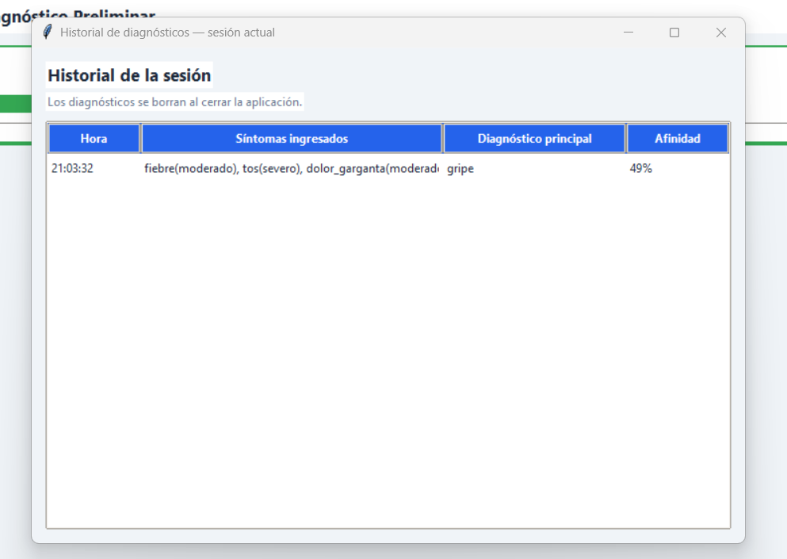
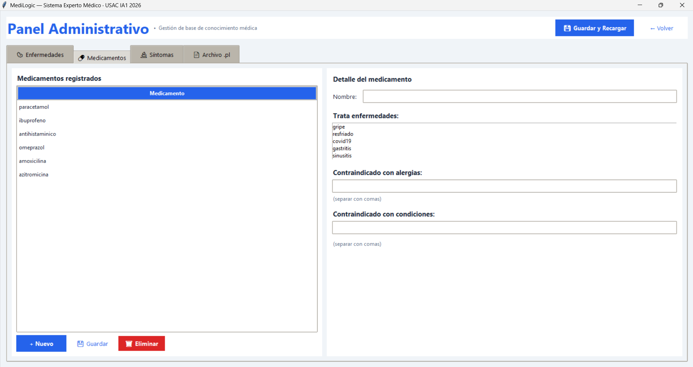
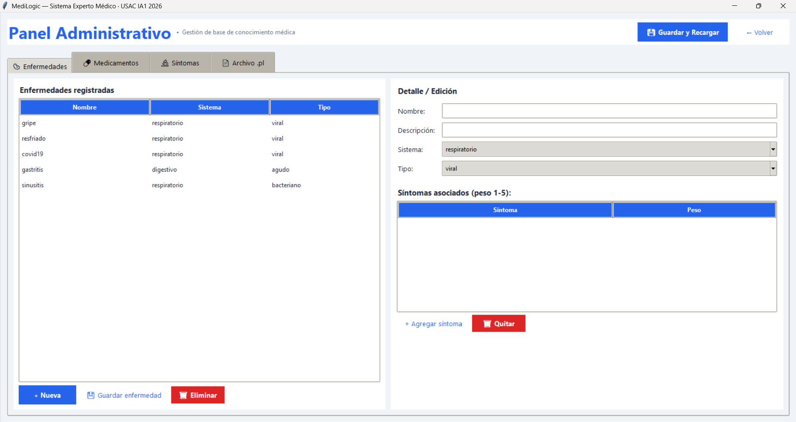
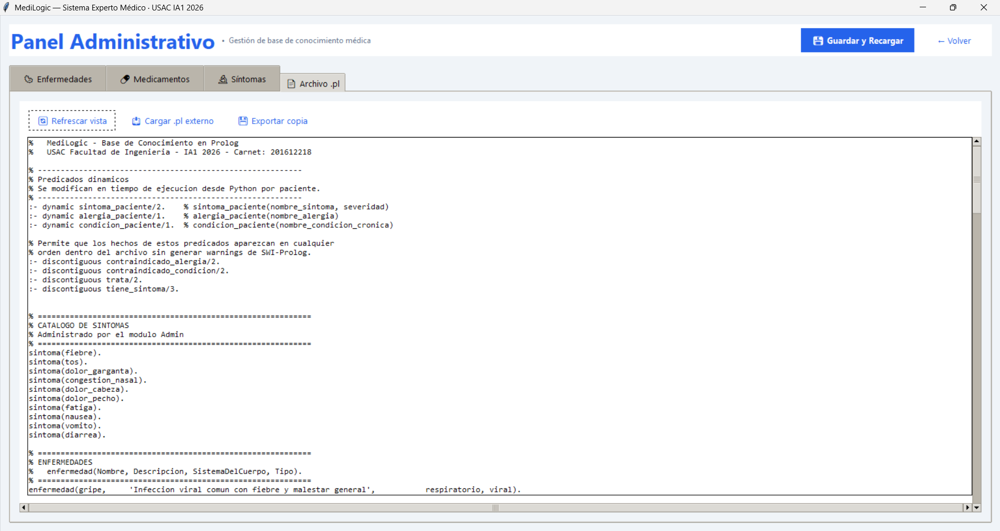

# MediLogic — Manual de Usuario
---

> ⚕ **AVISO IMPORTANTE:** MediLogic es una herramienta de orientación médica preliminar. Los resultados NO reemplazan la consulta con un médico profesional. Ante cualquier síntoma grave, acude inmediatamente a un centro de salud.

---

## 1. Instalación y Puesta en Marcha

### Requisitos previos
- Python 3.10 o superior
- SWI-Prolog 9.x instalado y agregado al PATH → [www.swi-prolog.org](https://www.swi-prolog.org/download/stable)

### Pasos de instalación

**1.** Descomprimir el proyecto en una carpeta local.

**2.** Abrir una terminal en la carpeta `P1/` e instalar dependencias:
```bash
pip install pyswip reportlab pyautogui Pillow
```

**3.** Verificar que SWI-Prolog está instalado:
```bash
swipl --version
```

**4.** Ejecutar la aplicación:
```bash
python main.py
```

**5.** Se abrirá la ventana principal de MediLogic con la descripción del sistema.

---

## 2. Vista para paciente

El módulo del paciente permite ingresar síntomas, alergias y condiciones crónicas para obtener un diagnóstico preliminar generado por el motor Prolog.

### Paso 1 — Abrir el módulo
En la pantalla de inicio, hacer clic en el botón azul **"Ingresar como Paciente"**. No se requiere contraseña.

### Paso 2 — Ingresar síntomas
En la pestaña **"Formulario de síntomas"** selecciona los síntomas que presentas y elige la severidad de cada uno:

| Severidad | Descripción | Multiplicador en Prolog |
|---|---|---|
| **Leve** | Síntoma presente pero tolerable | x1 |
| **Moderado** | Síntoma notable, afecta actividades | x2 |
| **Severo** | Síntoma intenso, limita el movimiento | x3 |

### Paso 3 — Seleccionar alergias y condiciones (opcional)
En los paneles de la derecha selecciona las alergias conocidas y condiciones crónicas preexistentes. Esta información se usa para filtrar medicamentos contraindicados.



### Paso 4 — Ejecutar el análisis
Presionar el botón azul **"Analizar síntomas → Prolog"**. El sistema carga el perfil en el motor Prolog y ejecuta las 5 queries de diagnóstico.

### Paso 5 — Interpretar los resultados
La pestaña **"Diagnóstico y resultados"** muestra una tarjeta por cada enfermedad con afinidad mayor a 0%, ordenadas de mayor a menor:



| Elemento | Descripción |
|---|---|
| **Nombre de enfermedad** | Enfermedad con mayor coincidencia primero |
| **Barra de afinidad** | Barra visual de 0 a 100% |
| **% de afinidad** | Calculado por Prolog según pesos y severidad |
| **Nivel de urgencia** | Indicador de acción recomendada |
| **Medicamentos seguros** | Solo muestra los que NO están contraindicados |
| **Reglas activadas** | Síntomas que coincidieron con los hechos Prolog |

### Niveles de urgencia

| Color | Nivel | Mensaje | Condición Prolog |
|---|---|---|---|
| Rojo | **Alta** | Consulta médica inmediata sugerida | `dolor_pecho` severo + enfermedad respiratoria |
| Amarillo | **Media** | Observación recomendada | Afinidad >= 60% |
| Verde | **Baja** | Posible automanejo | Afinidad < 60% |

### Paso 6 — Exportar informe PDF
En la pestaña de resultados hacer clic en **"Exportar PDF"** (esquina superior derecha). Selecciona la ubicación de guardado. El PDF incluye el diagnóstico completo con todas las enfermedades analizadas.

### Paso 7 — Ver historial de la sesión
En la barra superior hacer clic en **"Historial de sesión"**. Muestra todos los diagnósticos realizados durante la sesión actual. El historial se borra al cerrar la aplicación.


---

## 3. Módulo del Administrador

El módulo administrativo permite gestionar la base de conocimiento en tiempo real. Requiere autenticación.

### Credenciales de acceso

| Usuario | Contraseña | Rol |
|---|---|---|
| `admin` | `1234` | Administrador general |

### Gestión de Enfermedades (pestaña Enfermedades)

1. Clic en **"+ Nueva"** para limpiar el formulario
2. Completar: **Nombre**, **Descripción**, **Sistema del cuerpo**, **Tipo**
3. Agregar síntomas: clic en **"+ Agregar síntoma"**, seleccionar síntoma y peso (1-5)
4. Clic en **" Guardar y Recargar"** — escribe el `.pl` y recarga el motor Prolog automáticamente



### Gestión de Medicamentos (pestaña Medicamentos)

1. Clic en **"+ Nuevo"** e ingresar el nombre
2. En la lista **"Trata enfermedades"**, seleccionar las enfermedades que trata
3. En los campos de texto ingresar alergias y condiciones contraindicadas (separadas por comas)
4. Clic en **" Guardar"** y luego **" Guardar y Recargar"**



### Gestión del Archivo .pl (pestaña Archivo .pl)

- ** Refrescar vista:** muestra el contenido actual del `medilogic.pl`
- ** Cargar .pl externo:** importa un archivo `.pl` desde el disco y recarga el motor
- ** Exportar copia:** guarda una copia del `.pl` actual en la ubicación que elijas



---

## 4. RPA — Carga Masiva de Enfermedades

El RPA permite cargar múltiples enfermedades automáticamente desde un archivo de texto sin usar la interfaz gráfica.

### Formato del archivo de entrada (input_ejemplo.txt)

```
ENFERMEDAD: neumonia
DESCRIPCION: Infeccion que inflama los sacos de aire de uno o ambos pulmones
SISTEMA: respiratorio
TIPO: bacteriano
SINTOMAS: fiebre:4, tos:5, fatiga:4, dolor_pecho:5
MEDICAMENTOS: amoxicilina, paracetamol
CONTRA_ALERGIA: amoxicilina:alergia_penicilina
CONTRA_CONDICION:
---
```

### Ejecutar el RPA

```bash
# Carga directa (sin email) — genera bitácora .txt local
python rpa/rpa_carga.py --archivo rpa/input_ejemplo.txt

# Con envío de email
python rpa/rpa_carga.py --archivo rpa/input_ejemplo.txt \
    --email admin@correo.com \
    --smtp_user tucorreo@gmail.com \
    --smtp_pass TU_APP_PASSWORD
```

### Resultado esperado en terminal

```
============================================================
  MediLogic RPA - Iniciando
  Archivo de entrada: rpa/input_ejemplo.txt
============================================================

[PASO 1] Leyendo archivo de entrada...
         Se encontraron 3 enfermedad(es) para cargar.

[PASO 2] Cargando enfermedades al sistema...
[OK]  2026-03-13 | 'neumonia' cargada | sistema=respiratorio | sintomas=5
[OK]  2026-03-13 | 'bronquitis' cargada | sistema=respiratorio | sintomas=4
[OK]  2026-03-13 | 'migrania' cargada | sistema=neurologico | sintomas=4

[PASO 3] Guardando bitácora como archivo de texto...
[LOG] Bitácora guardada en: rpa_bitacora_20260313_XXXXXX.txt

[RPA] Proceso finalizado exitosamente.
```

---

## 5. Evaluación de Coherencia Diagnóstica — 3 Casos Clínicos

### Caso 1: Gripe estacional

**Perfil del paciente:** Hombre de 34 años. Síntomas: `fiebre` (severo), `tos` (moderado), `fatiga` (moderado), `dolor_cabeza` (leve). Sin alergias ni condiciones crónicas.

| Enfermedad | Afinidad | Urgencia | Medicamentos seguros |
|---|---|---|---|
| **gripe** | 67% |  Observación recomendada | paracetamol, ibuprofeno |
| covid19 | 55% |  Posible automanejo | paracetamol |
| resfriado | 18% |  Posible automanejo | paracetamol, ibuprofeno |

**Análisis:** Coherente. La gripe encabeza con 67% gracias al peso alto de `fiebre` (5) y `fatiga` (4), ambos con severidades altas. La urgencia media es correcta porque la afinidad supera el 60%. Los medicamentos son correctos ya que no hay contraindicaciones activas.

---

### Caso 2: Gastritis con alergia a AINEs

**Perfil del paciente:** Mujer de 45 años. Síntomas: `nausea` (severo), `vomito` (moderado), `fatiga` (leve). Alergia: `alergia_aines`. Condición: `gastritis_cronica`.

| Enfermedad | Afinidad | Urgencia | Medicamentos seguros |
|---|---|---|---|
| **gastritis** | 67% |  Observación recomendada | omeprazol |
| gripe | 9% |  Posible automanejo | paracetamol |

**Análisis:** Coherente. La gastritis lidera con 67%. El ibuprofeno fue excluido correctamente por la regla `medicamento_inseguro/1` — está contraindicado por `alergia_aines` Y por `gastritis_cronica`. Solo omeprazol aparece como seguro. Esto demuestra que el filtro de contraindicaciones funciona correctamente.

---

### Caso 3: Urgencia alta por dolor de pecho severo

**Perfil del paciente:** Hombre de 55 años. Síntomas: `dolor_pecho` (severo), `fiebre` (moderado), `tos` (moderado), `fatiga` (moderado). Sin alergias ni condiciones.

| Enfermedad | Afinidad | Urgencia | Medicamentos seguros |
|---|---|---|---|
| **covid19** | 52% |  Consulta médica inmediata | paracetamol |
| gripe | 44% |  Consulta médica inmediata | paracetamol, ibuprofeno |
| sinusitis | 31% |  Consulta médica inmediata | paracetamol, ibuprofeno, amoxicilina |

**Análisis:** Coherente. Todas las enfermedades respiratorias muestran urgencia **ALTA** porque la regla `nivel_urgencia/2` detecta `sintoma_paciente(dolor_pecho, severo)` y el corte `!` garantiza que no se evalúen las cláusulas de media/baja. Esto simula correctamente el comportamiento clínico esperado: dolor de pecho severo siempre debe tratarse como emergencia.


**Link video RPA**
